# The Algo

NFL betting model + pick engine. Multi-model predictions across sides, totals, derivatives,
and player props, with market-relative edge detection and CLV tracking.

> **Status: work in progress, and honest about it.**
>
> **What runs in production today is a market engine, not a model.** Picks come from
> devigged consensus fair prices shopped against 23 books — line shopping, which is a real
> edge source and the one that doesn't require beating anybody's forecast. No trained model
> has ever priced a live pick: the artifact registry is empty, `PUBLISH_MODEL_PICKS` is
> false, and the serving plane has no feature-vector path at all.
>
> **That is a decision, not an omission.** The model was trained on 27 features and
> walk-forward validated at **50.0%** against the closing spread — no edge. Shipping it
> anyway would have meant publishing picks driven by a forecast measured to be worthless.
> It stays offline until a retrain says otherwise.
>
> See [What is actually finished](#what-is-actually-finished) before reading anything below
> as a claim.

---

## What it eats, and what it actually digests

The gap between those two is the most important thing on this page.

```mermaid
flowchart LR
    subgraph collected["COLLECTED — 546 MB, 1999-2025"]
        pbp["play-by-play<br/>1.28M plays"]
        stats["player + team weekly<br/>476k rows"]
        snaps["snap counts<br/>325k rows"]
        inj["injuries<br/>90k rows"]
        ngs["NextGen / FTN / PFR<br/>charting"]
        depth["depth charts"]
        dead["contracts, draft, combine<br/><i>unused</i>"]
    end

    subgraph derived["DERIVED — warehouse"]
        ratings["unit_ratings<br/>ridge, opponent-adjusted<br/>point-in-time"]
        pw["player_weeks<br/>shares, EPA/target"]
        tw["team_weeks<br/>pace, splits"]
        xwalk["pfr to gsis crosswalk<br/>99.6%"]
    end

    subgraph live["LIVE FEEDS"]
        odds["Odds API<br/>23 books x 3 markets"]
        wx["weather by stadium"]
        omaha["Omaha<br/>typed injury records"]
    end

    subgraph model["MODEL — 27 live features"]
        feats["market spread + total<br/>rest, division, dome, slot, week<br/>12 unit ratings<br/>6 matchup edges"]
    end

    subgraph dormant["DECLARED BUT PINNED TO CONSTANTS"]
        pinned["wind, gusts, temp, precip<br/>market_home_prob<br/>line_move, dispersion, sharp_soft"]
    end

    pbp --> ratings
    stats --> pw
    pbp --> tw
    snaps --> xwalk
    ratings --> feats
    tw --> feats
    odds --> feats
    wx -.never wired.-> pinned
    inj -.never wired.-> pinned
    omaha -.next.-> pinned
    pw -.props only.-> feats

    feats --> blend
    odds --> blend["BLEND<br/>w on model, 1 minus w on market<br/>in logit space"]
    blend --> tier["TIER + KELLY<br/>edge %, correlation haircut"]
    tier --> agent{{"RED TEAM<br/>LLM veto"}}
    agent --> picks["PICKS"]

    style dormant fill:#3a2020,stroke:#a04040
    style dead fill:#3a2020,stroke:#a04040
    style model fill:#1f3a1f,stroke:#40a040
    style agent fill:#2a2a4a,stroke:#6060c0
```



**Read the dotted lines.** Weather is collected four times a day and has never reached the
model. Injuries are collected Wednesday, Thursday and Friday and have never reached the
model. Line movement can't reach it, because `odds_changes` holds a single timestamp and
history cannot be backfilled — those features can only be filled forward from September's
polls.

| | count |
|---|---|
| Raw data collected | 546 MB, 13 sources, 1999–2025 |
| Warehouse rows | ~1.3M across 11 views + 4 derived tables |
| Features declared in `shared/feature_spec.py` | 36 |
| Features the model saw **in training** | 27 |
| Features pinned to constants | 9 |
| **Features affecting a production pick** | **0** |

That last row is the important one. The research plane trains and validates; the serving
plane prices picks from the market alone. **The bridge between them — a serving-side
feature builder and an exported bundle — does not exist**, because the model measured
50.0% and there was nothing worth bridging.

Which also makes the 50.0% a *narrow* claim. It says team strength, rest and venue don't
beat the closing spread. It says nothing about weather, injuries or market
microstructure, because none of them were in the model when it was measured — and two of
those three now have data waiting.

### Two markets, two completely different machines

The most common misreading of this system is that it has one pipeline with data sources
weighted against each other. It doesn't. Full-game markets and player props work by
different mechanisms, and only one of them is running.

```mermaid
flowchart TB
    subgraph fullgame["FULL-GAME: spread, total, moneyline — RUNNING"]
        direction TB
        books["23 books x 3 markets<br/>polled on a kickoff-aware schedule"]
        devig["DEVIG each book<br/>multiplicative / additive / power / Shin"]
        cons["CONSENSUS<br/>weighted median, anchored on sharp books"]
        shop["SHOP<br/>best available price vs consensus fair price"]
        edge["EDGE %<br/>this is the whole signal"]
        books --> devig --> cons --> shop --> edge
    end

    subgraph blend["MODEL vs MARKET — weight is currently ZERO"]
        w["w on model, 1 minus w on market<br/>in log-odds space<br/><br/>w = 0 for every market<br/>measured: model is worse than a coin flip"]
    end

    subgraph props["PLAYER PROPS — DESIGNED, NOT BUILT"]
        direction TB
        l0["Layer 0 — P active<br/><i>does he play at all</i>"]
        l1["Layer 1 — snap share given active<br/><i>how much does he play</i>"]
        l2["Layer 2 — opportunities<br/><i>targets, carries, routes</i>"]
        l3["Layer 3 — per-opportunity outcome<br/><i>yards given a target</i>"]
        l4["Layer 4 — compose distribution"]
        l5["Layer 5 — correlation across props"]
        l0 --> l1 --> l2 --> l3 --> l4 --> l5
    end

    subgraph feeds["WHAT FEEDS THE PROP LAYERS"]
        inj["injury + practice status<br/><i>Omaha</i>"]
        script["game script from the market<br/><i>spread magnitude, implied total</i>"]
        call["play-calling tendency<br/><i>pbp, FTN charting</i>"]
        match["matchup adjustment<br/><i>NextGen, unit ratings</i>"]
    end

    inj --> l0
    script --> l1
    call --> l2
    match --> l3

    edge --> blend
    l5 -.not yet.-> blend
    blend --> tier["TIER + KELLY<br/>correlation haircuts"]
    tier --> rt{{"RED TEAM<br/>downgrade only"}}
    rt --> out["PUBLISHED PICKS"]

    style fullgame fill:#1f3a1f,stroke:#40a040
    style props fill:#3a3020,stroke:#a08040
    style blend fill:#3a2020,stroke:#a04040
    style rt fill:#2a2a4a,stroke:#6060c0
```

**Read the green box first.** That's the entire product today, and there is no model in
it. Picks are price discrepancies: devig 23 books, build a sharp-anchored consensus, and
find where somebody is offering better than the market's own fair price. Line shopping is
a real edge and the one that doesn't require out-forecasting anyone.

**The red box is where all the weighting lives**, and it's one scalar per market class —
not a matrix of source weights. Data sources don't get weighted individually; a model
combines them into one probability, and *that* gets weighted against the market's. Today
`w = 0` everywhere, because the model measured worse than predicting 0.5.

**The amber box is a chain, not a blend.** Each layer conditions on the one above:
multiplication, not averaging. A player 30% likely to be active has his whole
distribution scaled by 0.30 — he isn't "weighted down". Layer 0 is where the measured
injury signal applies, and it's the identified blocker: bust probability is currently a
player constant, and it isn't one.

**Timeline:** period and prop prices first arrive **6 September**, 72 hours before the
Week 1 opener, because those tiers only poll inside that window. Nothing in the amber box
can be validated before then.

### Where the LLM sits — and where it deliberately doesn't

One place only: a **red-team agent that can downgrade a pick and never upgrade one.**

It runs after the model has produced a probability and after Kelly has sized it. It reads
evidence — injury records, weather, line movement — and argues against publishing. It
cannot raise a tier, cannot increase a stake, and cannot emit a number.

> **Models produce numbers. Agents produce evidence. Agents never emit a probability.**

That constraint is structural, not stylistic. An LLM-produced probability has no
calibration curve and no way to tell whether a prompt change improved it or merely moved
it. A number you cannot backtest is a number you cannot bet.

It has already failed once in an instructive way: it downgraded **41%** of picks when
weather data was merely *missing*, having read "no value" as "bad value". That is why
[Omaha](https://github.com/esusslin/omaha) — the document layer that feeds this — reports
whether an absence means *healthy* or *unknown*, rather than returning an empty list and
letting the agent guess.

Design docs live outside this repo:
- `nfl_betting_system_architecture.md` — what and why (data sources, models, validation, betting ops)
- `nfl_implementation_architecture.md` — how (two-plane design, schema, AI agents, UI, build calendar)

---

## Two planes

| | Plane A — Research | Plane B — Serving |
|---|---|---|
| Runs | your laptop | Railway, 24/7 |
| Code | `research/` | `server.py`, `src/` |
| Data | DuckDB + parquet, 1999–present | SQLite on a volume |
| Deps | `requirements-research.txt` | `requirements.txt` |
| Output | versioned artifact bundle | picks |

Plane B never trains and never reads historical parquet. It loads an artifact bundle and
does arithmetic. `research/` must never be imported by `server.py`.

---

## Local setup

```bash
python3 -m venv .venv && source .venv/bin/activate
pip install -r requirements.txt
cp .env.example .env          # fill in keys
python -m src.db              # run migrations
uvicorn server:app --reload
```

Open http://localhost:8000/health

For the research plane: `pip install -r requirements.txt -r requirements-research.txt`

---

## Data ingestion

```bash
# see what nflverse actually publishes right now (never hardcode asset names)
python -m src.fetchers.nflverse discover
python -m src.fetchers.nflverse discover --tag ftn_charting

# schedules + closing lines back to 1999, and the player ID crosswalk
python -m src.fetchers.nflverse games
python -m src.fetchers.nflverse players

# one-time historical pull (research plane — big, run locally)
python -m src.fetchers.nflverse backfill --start 1999

# in-season refresh (what the scheduler calls)
python -m src.fetchers.nflverse refresh

# injuries — check sources are alive before trusting output
python -m src.fetchers.injuries probe
python -m src.fetchers.injuries refresh
```

### ⚠️ The injury feed is ours to maintain

nflverse's injury source died after the 2024 season — no 2025+ data, no ETA. Availability is
one of the highest-value non-market features, so `src/fetchers/injuries.py` builds the live
feed from Sleeper (primary) and ESPN (secondary). Historical 2009–2024 nflverse injury data is
still fine for training.

Run `probe` after any dependency bump or unexplained gap. These are undocumented endpoints
and they will change without notice.

---

## Key invariants

**1. Bitemporal storage.** Every context row carries `knowledge_time` — when *we* learned it,
not when it happened. The Wednesday injury report and the Friday one are separate rows. Never
upsert an older snapshot away; a model predicting at Wednesday-time must not see Friday's data.

**2. `shared/feature_spec.py` is the single source of truth.** Both planes import it. The
artifact bundle records `spec_hash()`, and the serving loader refuses to serve on mismatch.
Training/serving skew produces confident garbage that no metric will catch.

**3. Never fuzzy-match player names silently.** Odds-feed names vs. nflverse `gsis_id` is the
#1 source of bugs in this kind of system. Unresolved names are quarantined and counted, never
guessed. See `player_aliases`.

**4. Feature flags gate capability, not code.** Everything deferred is wired and switched off:

| Flag | Default | Flip when |
|---|---|---|
| `PUBLISH_MODEL_PICKS` | `false` | models log 2–3 weeks of positive live CLV |
| `ENABLE_PROPS` | `false` | ~Week 4–6 |
| `ENABLE_SIMULATOR` | `false` | ~Week 8 |
| `ENABLE_SMS` | `false` | after a full dry run you've watched |

---

## Deployment (Railway)

1. New project → deploy from this repo
2. Add a volume mounted at `/data`
3. Set env vars from `.env.example` (`DATABASE_PATH=/data/nfl.db`, `DATA_DIR=/data`, `ENV=production`)
4. **Pin to a single replica** — SQLite on a volume corrupts with concurrent writers
5. Push to `main` → Nixpacks builds → auto-deploy

`/health` reports per-job staleness, not just HTTP 200. It returns 200 while the process is
alive (so Railway doesn't restart a container over stale data) and sets `ok: false` when a job
is overdue. Point an external uptime pinger at it and alert on `ok`, not status code.

---

## What is actually finished

Stated at this granularity because "built a betting model" covers everything from a
notebook to a hedge fund, and the difference matters.

### Working, in production

- **Ingestion.** 13 nflverse sources with runtime asset discovery, Odds API polling with
  adaptive tiers and a credit ledger, weather by stadium, injuries Wed/Thu/Fri.
- **Research warehouse.** DuckDB over parquet, 11 views, 4 derived tables. `unit_ratings`
  is ridge-decomposed and computed point-in-time — each week uses only earlier weeks.
- **pfr→gsis crosswalk**, 99.6% of snap ids, coverage asserted in `verify()`.
- **Market machinery.** Four devig methods, per-book consensus with sharp anchoring,
  cross-book shopping, edge detection.
- **Pick pipeline.** Tiering, fractional Kelly with correlation haircuts, settlement,
  closing-line capture.
- **Cold-start shrinkage.** `k` fitted per play class by walk-forward; beats the no-prior
  baseline by 7–15% MAE on a held-out season.
- **Validation.** Leakage suite, walk-forward against a market baseline, a 55% accuracy
  tripwire, hash-validated artifact bundles.
- **Observability.** `/health` reports per-source staleness and job outcomes, not liveness.

### Measured, and negative

- **50.0% against the closing spread.** Real result, narrow scope — team strength, rest
  and venue only. Not a statement about weather, injuries or microstructure.

- **Injuries do not help full-game spreads.** Measured 24 Aug 2026 as a controlled A/B:
  same seasons, same rows, identical design-matrix width, with the availability block
  zeroed rather than dropped so column order couldn't drift.

  | arm | Brier | Δ vs always-0.5 | cover accuracy |
  |---|---|---|---|
  | baseline | 0.2562 | −0.0062 | 48.4% |
  | **+ availability** | 0.2563 | −0.0063 | 48.1% |
  | market | — | — | **52.7%** |

  Eight new features — counts Out and Questionable, QB out, and prior-4-week snap share
  of unavailable players — moved Brier by **0.0001** and accuracy by **−0.3pp**. Noise.
  The model remains worse than predicting 0.5 for everything.

  **This was the expected result and the repo said so before the run.** Books read the
  same injury report hours earlier; a closing line that didn't price it would be the
  surprise. The measurement's value is that it converts an assumption into a number and
  closes off a direction that looked obviously worth pursuing.

  **It does not mean the injury work was wasted — it means it was aimed at the wrong
  market.** `research/practice_signal.py` measured +0.054 AUC on `P(player is active)`,
  which is a *prop* input, not a spread input. A quarterback ruled out moves a spread the
  market has already moved; whether a questionable receiver takes the field decides
  whether his receptions prop settles at zero.
- **Practice participation carries signal.** +0.054 AUC on the Questionable panel across
  90,467 injury rows, walk-forward by season. Measured *before* building the pipeline that
  would use it.

### Not built, in the order it matters

| | what | why it isn't done |
|---|---|---|
| 1 | **The prop engine's serving path** | Now the top item, on evidence rather than plan. `research/props.py` has distributional projections and a hurdle model; there is no route from those to a published pick. This is where the measured injury signal actually applies — `P(active)` is a prop input. |
| 2 | **Period and prop market coverage** | `odds_current` carries h2h, spreads and totals only. The `period` and `props` polling tiers exist and fire within 72h of kickoff, so first real data arrives **6 Sept**. |
| 3 | **Blend-weight adaptation from CLV** | `w` should drift weekly from measured closing-line value, capped at ±0.02/week, floored at 30 picks, bounded to [0, 0.6]. Needs live picks in a market where a model is actually running. |

**Deliberately not on this list:** a serving-side feature path for full-game spreads. It
was item 2 until the A/B above; there is no point wiring a model into production that is
measurably worse than predicting 0.5.
| 5 | **Prop engine** | Distributional projections and the hurdle model exist in `research/props.py`; the serving path and 1H markets don't. |
| 6 | **QB-conditional ratings** | A backup start currently corrupts a team's rating for weeks. Needs the injury feed above. |
| 7 | **State-space team ratings** | The principled answer to mid-season regime change. Ridge + recency weighting is the stopgap. |

### Known-wrong, tracked

- `injuries` resolves 23% by ID and 13% not at all (`gsis=147 name=405 ambiguous=18
  unresolved=67` of 648). Name matching is a bridge, not a solution.
- Live `injuries` and `weather_snapshots` tables are empty — the historical data is in
  parquet and the serving tables have never had a real game week.
- 2025 is the one season where the practice signal goes negative on the Questionable
  panel. One season, n=327, recorded rather than smoothed over.

### What "finished" would mean

A season of live picks with measured CLV by tier and market class, blend weights that have
adapted from that CLV, and an honest answer to whether any of it beats the closing line.
That answer may well be no. The system is built so that a no is *legible* rather than
deniable — which is the only version of this worth running.
